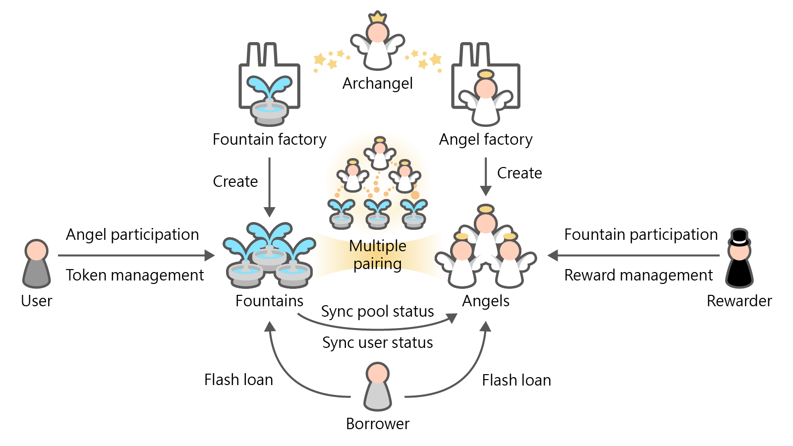

# Trevi

Trevi is an ERC20-based staking system. It enables users to stake their token and join different Angel's reward program without the necessity of moving their funds again, which can greatly improve the capital efficiency.

Anyone can create Fountain for a token through Fountain factory. Anyone can create Angel to run their own rewarding program through Angel factory. **AVOID USING TOKENS THAT HAS FLOATING AMOUNT** (including Inflationary/Deflationary tokens, Interest tokens, Rebase tokens), which might leads to error according to the design policy.

The interaction between a user and Fountain can be divided into two groups

- Angel participation, users can have their own choice on which Angel to join. Joining multiple Angel is possible.
- Token management, user can
  - Deposit or withdraw their funds into Fountain to manage their assets to participate in the ongoing or future program from Angel.
  - Harvest the reward from the Angel they joined.

The interaction between a rewarder and Angel can be divided into two groups

- Fountain participation, rewarder can assign which token to be rewarded, which leads to different Fountain. Configuration is assigned separately, which means that different Fountain may have different reward allocation point.
- Reward management, rewarder can assign the rewarding amount and time interval to manage the distribution speed of reward.

## Archangel

Archangel records the relationship between [Fountain](#fountains) and [Angel](#angels), and manages the configuration of flash loan related functions.

##### Functions

###### `constructor(uint256 _defaultFlashLoanFee)` (public)

###### `getFountain(IERC20 token) → Fountain` (external)

Get Fountain for the given token.

###### `rescueERC20(IERC20 token, Fountain from) → uint256` (external)

Fetch the token from Fountain or Archangel itself. Can only be called from the owner.

###### `setDefaultFlashLoanFee(uint256 fee)` (external)

Set the default fee rate for flash loan. The default fee rate will be applied when Fountain or Angel is being created. Can only be set by the owner.

###### `setFlashLoanFee(address lender, uint256 fee)` (external)

Set the flash loan fee rate of Angel or Fountain. Can only be set by the owner.

## Fountains

Fountain is the place people toss their coin, wishing for good fortune. Users may stake their assets in the corresponding Fountain and receive the grace from [Angel](#angels).

### FountainFactory

Only Fountain that is created from FountainFactory can be applied in Trevi. Each token can only have one Fountain being created. Anyone can create Fountain for a token.

##### Events

###### `Created(address to)`

##### Functions

###### `isValid(Fountain fountain) → bool` (external)

Check if Fountain is valid.

###### `fountainOf(IERC20 token) → Fountain` (external)

Get Fountain of the given token.

###### `create(ERC20 token) → Fountain` (external)

Create Fountain for the given token.

#### Fountain

Assets being staked by users are kept in Fountain. Users may select the Angel they would like to join through Fountain.

##### Events

###### `Join(address user, address angel)`

###### `JoinApproval(address user, address sender, uint256 timeLimit)`

###### `Quit(address user, address angel)`

###### `RageQuit(address user, address angel)`

###### `Deposit(address user, uint256 amount, address to)`

###### `Withdraw(address user, uint256 amount, address to)`

###### `EmergencyWithdraw(address user, uint256 amount, address to)`

###### `Harvest(address user)`

###### `HarvestApproval(address owner, address sender, uint256 timeLimit)`

##### Functions

###### `constructor(IERC20 token, string name_, string symbol_, uint256 flashLoanFee)` (public)

When creating Fountain for the given contract, an `FTN-symbol_` token will be created. The FTN token represents the ownership of the deposited tokens in Fountain.

###### `joinedAngel(address user) → IAngel[]` (public)

Return Angel that user joined.

###### `angelInfo(IAngel angel) → uint256, uint256` (external)

Return the information of Angel. The Fountain needs to be added by Angel.

###### `setPoolId(uint256 pid)` (external)

Angel may set their own pid that matches the staking token of Fountain.

###### `deposit(uint256 amount)` (external)

Users may deposit their token. FTN token will be minted. Fountain will call Angel's `deposit()` to update user information, but the tokens stay in Fountain.

###### `depositTo(uint256 amount, address to)` (external)

Users may deposit their token for `to`. FTN token will be minted to `to`. Fountain will call Angel's `deposit()` to update user information, but the tokens stay in Fountain.

###### `withdraw(uint256 amount)` (external)

Users may withdraw their token. FTN token will be burned. Fountain will call Angel's `withdraw()` to update user information, but the tokens will be transferred from Fountain.

###### `withdrawTo(uint256 amount, address to)` (external)

Users may withdraw their token to `to`. FTN token will be burned. Fountain will call Angel's `withdraw()` to update user information, but the tokens will be transferred from Fountain.

###### `harvest(IAngel angel)` (external)

Users may harvest from any Angel.

###### `harvestAll()` (external)

Users may harvest from all the joined Angel.

###### `harvestTimeLimit(address owner, address sender) → uint256` (external)

Return the time limit that the `owner` approved to the `sender`.

###### `harvestApprove(address sender, uint256 timeLimit) → bool` (external)

Approve the `sender` to harvest for `msg.sender` before `timeLimit`.

###### `harvestPermit(address owner, address sender, uint256 timeLimit, uint256 deadline, uint8 v, bytes32 r, bytes32 s)` (public)

Approve the `sender` to harvest for the `owner` before `timeLimit`.

###### `harvestNonces(address owner) → uint256` (external)

Returns the nonce of permitted harvest of the `owner`.

###### `harvestFrom(IAngel angel, address from, address to)` (public)

Users may harvest from any Angel for a permitted `from`. The harvested reward will be transferred to `to`.

###### `harvestAllFrom(address from, address to)` (public)

Users may harvest from all the joined Angel for a permitted `from`. The harvested reward will be transferred to `to`.

###### `harvestFromWithPermit(IAngel angel, address from, address to, uint256 timeLimit, uint256 deadline, uint8 v, bytes32 r, bytes32 s)` (external)

Perform `harvestFrom()` after permit.

###### `harvestAllFromWithPermit(address from, address to, uint256 timeLimit, uint256 deadline, uint8 v, bytes32 r, bytes32 s)` (external)

Perform `harvestAllFrom()` after permit.

###### `emergencyWithdraw()` (external)

Withdraw all the tokens without caring about the rewards. EMERGENCY ONLY.

###### `joinAngel(IAngel angel)` (external)

Join given Angel's program.

###### `joinAngels(IAngel[] angels)` (external)

Join multiple Angel's program.

###### `joinTimeLimit(address user, address sender) → uint256` (external)

Return the time limit the `user` approved to the `sender`.

###### `joinApprove(address sender, uint256 timeLimit) → bool` (external)

Approve the `sender` to join for `msg.sender` before `timeLimit`.

###### `joinPermit(address user, address sender, uint256 timeLimit, uint256 deadline, uint8 v, bytes32 r, bytes32 s)` (public)

Approve the `sender` to join for the `user` before `timeLimit`.

###### `joinNonces(address user) → uint256` (external)

Returns the nonce of permitted join of the `user`.

###### `joinAngelFor(IAngel angel, address user)` (public)

Users may join Angel for a permitted `user`.

###### `joinAngelsFor(IAngel[] angels, address user)` (public)

Users may join multiple Angel for a permitted `user`.

###### `joinAngelForWithPermit(IAngel angel, address user, uint256 timeLimit, uint256 deadline, uint8 v, bytes32 r, bytes32 s)` (external)

Perform `joinAngelFor()` after permit.

###### `joinAngelsForWithPermit(IAngel[] angels, address user, uint256 timeLimit, uint256 deadline, uint8 v, bytes32 r, bytes32 s)` (external)

Perform `joinAngelsFor()` after permit.

###### `quitAngel(IAngel angel)` (external)

Quit the given Angel's program.

###### `quitAllAngel()` (external)

Quit all joined Angel's program.

###### `rageQuitAngel(IAngel angel)` (external)

Quit an Angel's program without caring about the rewards. EMERGENCY ONLY.

###### `name() → string` (public)

Returns the name of the token.

###### `symbol() → string` (public)

Returns the symbol of the token, usually a shorter version of the name.

###### `decimals() → uint8` (public)

Returns the number of decimals used to get its user representation.

###### `totalSupply() → uint256` (public)

Returns the number of total supply.

###### `balanceOf(address account) → uint256` (public)

Returns the balance of the given `account`.

###### `transfer(address recipient, uint256 amount) → bool` (public)

Apply nonReentrant to transfer. When transferring the FTN token from the `msg.sender` to the `recipient`, will withdraw the `msg.sender`'s funds and deposit to the `recipient`'s account.

###### `transferFrom(address sender, address recipient, uint256 amount) → bool` (public)

Apply nonReentrant to transfer. When transferring the FTN token from the `sender` to the `recipient`,
will withdraw the `sender`'s funds and deposit to the `recipient`'s account.

###### `permit(address owner, address spender, uint256 value, uint256 deadline, uint8 v, bytes32 r, bytes32 s)` (public)

Execute the `owner`'s approval through the provided information and signature.

###### `nonces(address owner) → uint256` (public)

Returns the nonce of the `owner`.

###### `batch(bytes[] calls, bool revertOnFail) → bool[] successes, bytes[] results` (external)

Batch the given calls to this contract.

###### `permitToken(IERC20Permit token, address from, address to, uint256 amount, uint256 deadline, uint8 v, bytes32 r, bytes32 s)` (public)

Execute permit call to compatible token contract.

###### `transferFromWithPermit(address owner, address recipient, uint256 value, uint256 deadline, uint8 v, bytes32 r, bytes32 s) → bool` (external)

Execute `transferFrom` after doing permit.

###### `rescueERC20(IERC20 token, address to) → uint256` (external)

Fetch the `token` from Fountain. Can only be called by Archangel. Will only fetch the extra part if the token is the staking token. Otherwise the entire balance will be fetched.

###### `setFlashLoanFee(uint256 fee)` (public)

Set the fee rate for flash loan. Can only be set by Archangel.

## Angels

Angel give their grace to people. Rewarders may manage their rewards schedule and configuration through Angel.

### AngelFactory

Only Angel that is created from AngelFactory can be applied in Trevi. Each token can have multiple Angel being created. Anyone can create Angel.

##### Events

###### `Created(address to)`

##### Functions

###### `isValid(Angel angel) → bool` (external)

Check if Angel is valid.

###### `rewardOf(Angel angel) → IERC20` (external)

Get the reward token of Angel.

###### `create(IERC20 reward) → Angel` (external)

Create Angel of the given token as reward. Multiple Angel for the same token is possible.

### Angel

Angel is a forked version of [MiniChefV2](https://github.com/sushiswap/sushiswap/blob/canary/contracts/MiniChefV2.sol) from [Sushiswap](https://github.com/sushiswap/sushiswap). Angel brings the grace through distributing the reward token to the participants.

##### Events

###### `Deposit(address user, uint256 pid, uint256 amount, address to)`

###### `Withdraw(address user, uint256 pid, uint256 amount, address to)`

###### `EmergencyWithdraw(address user, uint256 pid, uint256 amount, address to)`

###### `Harvest(address user, uint256 pid, uint256 amount)`

###### `LogPoolAddition(uint256 pid, uint256 allocPoint, IERC20 lpToken, IRewarder rewarder)`

###### `LogSetPool(uint256 pid, uint256 allocPoint, IRewarder rewarder, bool overwrite)`

###### `LogUpdatePool(uint256 pid, uint64 lastRewardTime, uint256 lpSupply, uint256 accGracePerShare)`

###### `LogGracePerSecondAndEndTime(uint256 gracePerSecond, uint256 endTime)`

##### Functions

###### `constructor(IERC20 token, uint256 flashLoanFee)` (public)

###### `poolLength() → uint256 pools` (public)

Returns the number of MCV2 pools.

###### `lastTimeRewardApplicable() → uint256` (public)

Return the last applicable time for reward calculation.

###### `add(uint256 allocPoint, IERC20 _lpToken, IRewarder _rewarder)` (external)

Add a new LP to the pool. Can only be called by the owner.

###### `set(uint256 _pid, uint256 _allocPoint, IRewarder _rewarder, bool overwrite)` (external)

Update the given pool's GRACE allocation point and `IRewarder` contract. Can only be called by the owner.

###### `addGraceReward(uint256 _amount, uint256 _endTime)` (external)

Add extra amount of GRACE to be distributed and the end time. Can only be called by the owner.

###### `setGracePerSecond(uint256 _gracePerSecond, uint256 _endTime)` (external)

Set the GRACE per second to be distributed. Can only be called by the owner.

###### `pendingGrace(uint256 _pid, address _user) → uint256 pending` (external)

View function to see pending GRACE on frontend.

###### `massUpdatePoolsNonZero()` (public)

Update reward variables for all pools with non-zero allocPoint. Be careful of gas spending!

###### `massUpdatePools(uint256[] pids)` (public)

Update reward variables for all pools. Be careful of gas spending!

###### `massUpdatePoolsAndSet(uint256[] pids)` (external)

Update reward variables for all pools and set the expire time for skipping `massUpdatePoolsNonZero()`. Be careful of gas spending! Can only be called by the owner. DO NOT use this function until `massUpdatePoolsNonZero()` reverts because of out of gas. If that is the case, try to update all pools first and then call onlyOwner function to set a correct state.

###### `updatePool(uint256 pid) → AngelBase.PoolInfo pool` (public)

Update the reward variables of the given pool.

###### `deposit(uint256 pid, uint256 amount, address to)` (external)

Deposit LP tokens to MCV2 for GRACE allocation. Can only be called from corresponding Fountain.

###### `withdraw(uint256 pid, uint256 amount, address to)` (external)

Withdraw LP tokens from MCV2. Can only be called from corresponding Fountain.

###### `harvest(uint256 pid, address from, address to)` (external)

Harvest proceeds for the transaction sender to `to`. Can only be called from corresponding Fountain.

###### `emergencyWithdraw(uint256 pid, address to)` (external)

Withdraw without caring about the rewards. EMERGENCY ONLY. Can only be called from corresponding Fountain.

###### `rescueERC20(IERC20 token, uint256 amount, address to) → uint256` (external)

Fetch the `amount` of `token` from Angel. Can only be called by owner.

###### `setFlashLoanFee(uint256 fee)` (public)

Set the fee rate for flash loan. Can only be set by Archangel.

###### `flashLoanFeeCollector() → address` (public)

Set the fee collector. Fee are transferred to Archangel after flash loan execution.

## FlashLoan

The assets in Fountain and Angel can be flashLoaned by user, which is implemented through [ERC-3156](https://eips.ethereum.org/EIPS/eip-3156). The fee rate is set through [Archangel](#archangel), and the fee is collected at [Archangel](#archangel).

##### Functions

###### `maxFlashLoan(address token) → uint256` (external)

The amount of currency available to be lended.

###### `flashFee(address token, uint256 amount) → uint256` (public)

The fee to be charged for a given loan.

###### `flashLoan(IERC3156FlashBorrower receiver, address token, uint256 amount, bytes data) → bool` (external)

Initiate a flash loan.

###### `flashLoanFeeCollector() → address` (public)

Returns the address of the fee collector.
